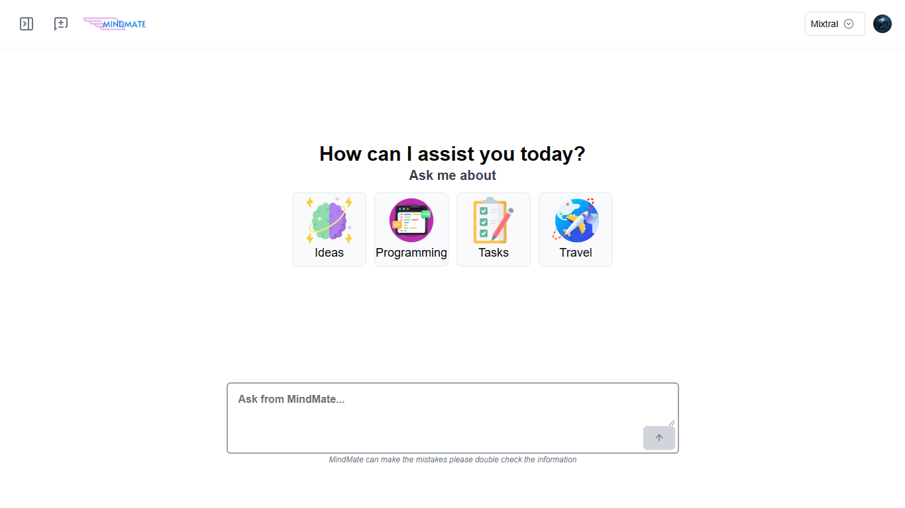

# MindMate

MindMate is a ChatGPT clone designed for powerful and efficient conversational AI, leveraging multiple large language models to provide a flexible and dynamic interaction experience. Built with **Next.js 14** and using **Hono** for fast, serverless API handling, MindMate brings together several powerful AI models and robust backend integrations for a comprehensive chatbot application.

## 📋 Project Overview

MindMate integrates various models like **Llama** and **Gemma** to offer versatility across AI capabilities. The app also uses **Clerk** for seamless authentication, **PostgreSQL** as the database, and **Drizzle ORM** for simplified database interactions. **Vercel AI SDK** facilitates communication with the AI models.

## 🚀 Tech Stack

- **Frontend**: Next.js 14
- **API**: Hono
- **Authentication**: Clerk
- **Database**: PostgreSQL, Drizzle ORM
- **Model Interaction**: Vercel AI SDK
- **Deployment**: Vercel

## ✨ Key Features

- **Multiple AI Models**: Includes Llama 3.1 70B, Gemma 9B, Jasper, Llama 3 Groq, Llama 3.2 1B, Llama 3.5, Llama 3.2 90B, Mixtral, and more.
- **Dynamic Model Selection**: Allows users to select specific models based on the conversation needs.
- **Optimized Model Interaction**: Vercel AI SDK optimizes model communication for smooth and efficient interaction.
- **Secure Authentication**: Integrated with Clerk for managing user authentication and sessions.
- **Scalable Database Solution**: PostgreSQL with Drizzle ORM for managing AI conversation histories and user data.

## 📂 Project Structure

```plaintext
MindMate
├── app
     ├──  api          # API routes powered by Hono
     ├──  (auth)       # Auth powered by clerk  
     ├──  (root)       # Site
     ├──  fonts        # All fonts
     ├──  global.css   # Styles and Tailwind CSS directories
     ├──  favicon.ico  # Fav Icon
     ├──  layout.tsx   # Root layout of site

├── components         # Reusable UI components
├── lib                # Schemas, Queries of Drizzle ORM and database connection  
├── public             # Static assets
